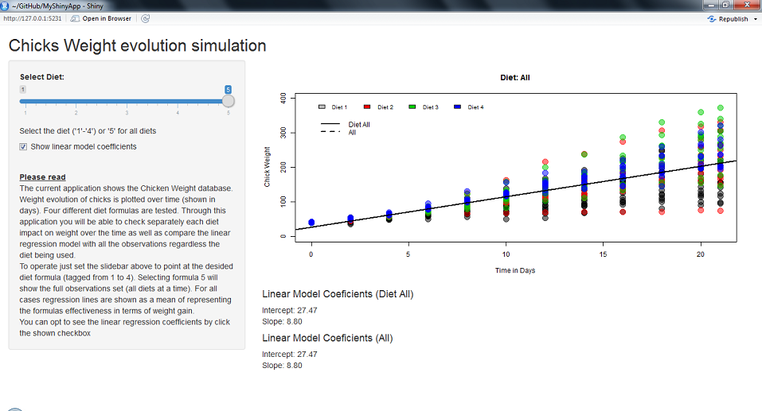

## General Description

An experiment was conducted to measure and compare the effectiveness of various feed supplements on the growth rate of chickens.

Newly hatched chicks were randomly allocated into six groups, and each group was given a different feed supplement. Their weights in grams after six weeks are given along with feed types.

We try to explore which feed formula manages to maximize weight gain by comparing the different experiments. To do this a linear model is fit for feed suplement subset. An aditional model is fit for every observation regardless the formula used.

Having the chance to plot the models on the same reference frame while keeping the general model visible for every formula feed we can have a clear idea of the relative impact of the different suplements on the chicks population.

--- .class.id

## Data

A data frame with 71 observations on the following 2 variables: weight (a numeric variable giving the chick weight) and feed (a factor giving the feed type).

A simple description of the data can be seen here:

``` {r stats}
head(ChickWeight)

```

--- .class.id

## The Shiny application



--- .class.id

## User manual

The current application shows the Chicken Weight database. Weight evolution of chicks is plotted over time (shown in days). Four different diet formulas are tested. Through this application you will be able to check separately each diet impact on weight over the time as well as compare the linear regression model with all the observations regardless the diet being used.

To operate just set the slidebar above to point at the desided diet formula (tagged from 1 to 4). Selecting formula 5 will show the full observations set (all diets at a time). For all cases regression lines are shown as a mean of representing the formulas effectiveness in terms of weight gain.

You can opt to see the linear regression coefficients by click the shown checkbox.


